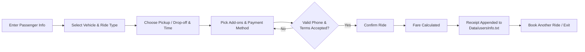

<div align="center">


# 🚖 ShohozRide — Ride Booking Management System

**"Shohoz Ride, Shohoz Life"**
*A desktop Ride Booking & Fleet Management System built with Java Swing*

[](https://www.oracle.com/java/)
[](#)
[](#)
[](#)
[](#)

</div>

---

## 📖 Overview

**ShohozRide** is a Java Swing desktop application that simulates a **ride-booking and fleet management platform** — similar in spirit to Uber or Pathao — built as an **Object-Oriented Programming (OOP)** course project at **American International University–Bangladesh (AIUB)**.

The app walks a passenger through a full booking flow inside a single, form-driven GUI: entering personal details, picking a vehicle, choosing pickup/drop-off points, selecting add-ons and a payment method, and finally generating a **formatted digital receipt** that is appended to a local text file — acting as a lightweight booking ledger/database.

<p align="center">
  
</p>

---

## ✨ Features

- 🧍 **Passenger Information Form** — captures full name, phone number, emergency contact, and gender.
- 🔒 **Input Validation** — Bangladeshi mobile number format is validated (11 digits, valid operator prefix) before a booking can be confirmed.
- 🚗 **Vehicle Selection** — choose from 5 vehicle classes, each with a live preview image and its own per-km rate:

  | Vehicle | Rate (BDT/km) | A/C & Music Toggle | Add-ons Available |
  |---|---|---|---|
  | 🏍️ Motorbike | 5 | ❌ | ❌ |
  | 🛺 CNG | 8 | ❌ | ✅ |
  | 🚙 SUV | 100 | ✅ | ✅ |
  | 🚐 MicroBus | 300 | ✅ | ✅ |
  | 🚌 Hi-Ace | 350 | ✅ | ✅ |

- 🏷️ **Ride Class** — toggle between **Economy** and **Premium** tiers (Premium adds a flat classification surcharge).
- 📍 **Route & Distance Engine** — pickup/drop-off locations are matched against a built-in distance lookup table covering Savar, Kuril, Mirpur, Gulshan, Badda, Dhanmondi, and Mohammadpur.
- 🕒 **Ride Scheduling** — pick an hour, minute, and AM/PM slot for the trip.
- 🧳 **Add-ons** — optional Luggage Carrier, Child Seat, and Wheel Chair support, each with its own surcharge.
- 💳 **Multiple Payment Methods** — bKash, Nagad, or Credit/Debit Card, tied to an account/card number field.
- 🧮 **Automatic Fare Calculation** — `Total = Vehicle Classification Rate + Add-on Rate + (Vehicle Rate × Distance)`.
- 🧾 **Digital Receipt Generation** — on confirmation, a neatly formatted booking receipt is written to `Data/usersInfo.txt`, including passenger info, trip details, vehicle preferences, and a full billing breakdown.
- ✅ **Terms & Conditions Gate** — booking is only enabled once contact details are valid and terms are accepted.
- 🔁 **Book Another Ride** — reset the form and start a new booking without restarting the app.

<p align="center">
  
  
  
</p>

---

## 🏗️ Project Structure

```
RIDE-BOOKING-MANAGEMENT-SYSTEM/
├── Start.java                       # Application entry point (launches the GUI)
├── GUI/
│   └── MainFrame.java                # Core Swing UI: forms, layout, event handling, pricing logic
├── RideBookingManagement/
│   └── Customer.java                  # Customer model + receipt/file-writing logic
├── Data/
│   └── usersInfo.txt                  # Auto-generated booking ledger (receipts appended here)
├── images/                           # Vehicle art, logos, and step icons used by the GUI
│   ├── addOn/                          # Luggage, child seat, wheelchair icons
│   └── headinLogo/                     # Section header icons (Passenger / Vehicle / Booking)
├── todo.txt                          # Development notes & future improvement ideas
└── README.md
```

### 🧩 Design at a Glance

- **`Start`** — a minimal launcher that instantiates and displays `MainFrame`.
- **`GUI.MainFrame`** — extends `JFrame`, implements `ActionListener` and `MouseListener`; owns all UI components, the vehicle/route pricing tables, phone-number validation, and the confirmation flow.
- **`RideBookingManagement.Customer`** — a plain-old Java object that encapsulates a single booking's data and knows how to serialize itself into a human-readable receipt via `insertInfo()`.

---

## 🚀 Getting Started

### Prerequisites

- **JDK 8+** (Java Swing is part of the standard library — no external dependencies needed)
- Any terminal, or an IDE such as IntelliJ IDEA, Eclipse, or VS Code with the Java extension pack

### Run it locally

```bash
# 1. Clone the repository
git clone https://github.com/Wesly-x-dev/RIDE-BOOKING-MANAGEMENT-SYSTEM.git
cd RIDE-BOOKING-MANAGEMENT-SYSTEM

# 2. Compile all source files
javac Start.java GUI/MainFrame.java RideBookingManagement/Customer.java

# 3. Run the application
java Start
```

> 💡 Run these commands from the **project root** so the relative `images/` and `Data/` paths resolve correctly, and so the `GUI` / `RideBookingManagement` packages match their folder names.

---

## 🧭 How a Booking Flows



---

## 🧾 Sample Receipt

Every confirmed booking is appended to `Data/usersInfo.txt` in a format like this:

```
 ==================== BOOKING RECIEPT =================== 
                ShohozRide - Booking Successful!               
 ===================================================== 
 PASSENGER INFORMATION: 
 ---------------------------------------------------------------- 
 Name:            Atif
 Phone:           01812579074
 Emergency Contact: 01812579071
 Gender:          Male

 TRIP DETAILS: 
 ---------------------------------------------------------------- 
 Pick UP:         Aiub, Kuril
 Drop At:         27, Dhanmondi
 Pick UP Time:    3:30 PM

 VEHICLE & PREFERENCES: 
 ---------------------------------------------------------------- 
 Vehicle Type:    MicroBus (Premium)
 Air Conditioning: No
 In-Ride Music:   No
 Add-ons:         Luggage Carrier, Child Seat, Wheel Chair

 BILLING & PAYMENT SUMMARY: 
 ---------------------------------------------------------------- 
 Payment Method:  (0687576565) Bkash
 Base Rate:       300.0 BDT / km
 Ride Fare:       7500.0 BDT
 Add-on Total:    550.0 BDT
 ---------------------------------------------------------------- 
 TOTAL AMOUNT PAID: 8550.0 BDT
 ===================================================== 
              Thank you for riding with ShohozRide!                
 ===================================================== 
```

---

## 🗺️ Roadmap / Known Improvements

Taken from the project's own development notes (`todo.txt`), some planned refinements include:

- [ ] Stronger validation/formatting for name, pickup venue, and drop-off venue fields
- [ ] Expanded scheduling options for pickup time
- [ ] A refreshed visual theme (a "Warm Coral" palette is sketched out in the notes)
- [ ] Broader coverage of pickup/drop-off locations beyond the current 7-area distance table

Contributions and suggestions along these lines are welcome — see below.

---

## 🤝 Contributing

This started as a university coursework project, but improvements are welcome:

1. Fork the repository
2. Create a feature branch (`git checkout -b feature/your-feature`)
3. Commit your changes
4. Open a Pull Request describing what you changed and why

---

## 🎓 Academic Context

This project was developed for an **Object-Oriented Programming** course at **American International University–Bangladesh (AIUB)**, demonstrating core OOP concepts including:

- Encapsulation of booking data inside the `Customer` class
- Separation of UI (`GUI`) from domain logic (`RideBookingManagement`)
- Event-driven programming via `ActionListener` / `MouseListener`
- File I/O for persistent, human-readable data storage

---

## 📜 License

No license has been specified for this repository. If you intend to reuse this code, please reach out to the repository owner, [**Wesly-x-dev**](https://github.com/Wesly-x-dev).

---

<div align="center">

Made with ☕ and Java Swing — **ShohozRide, Shohoz Life** 🚖

</div>
